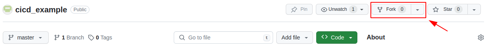
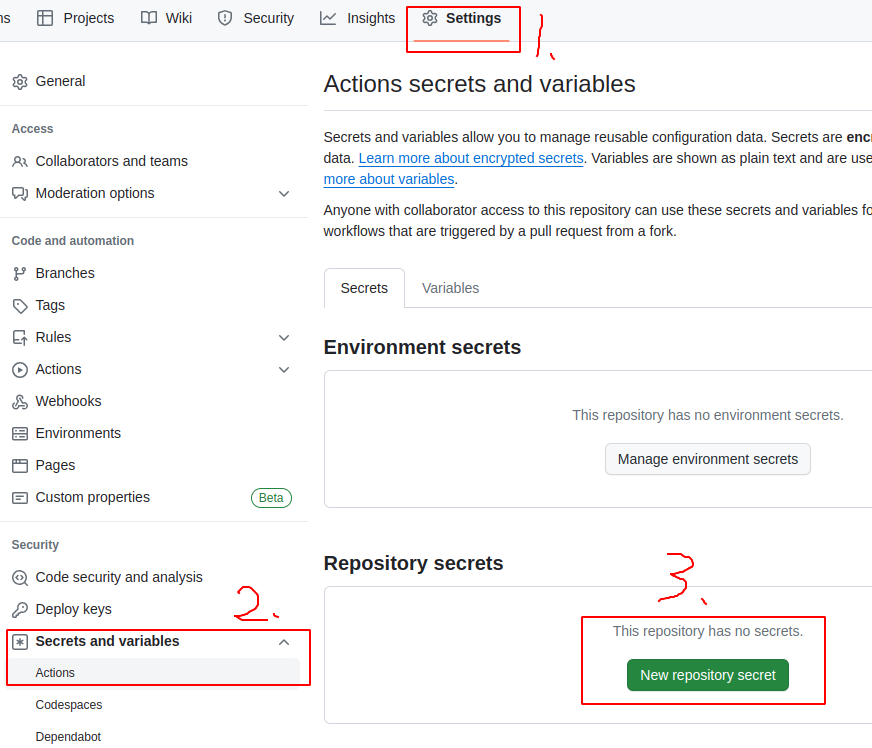
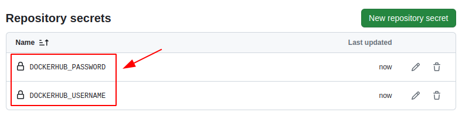
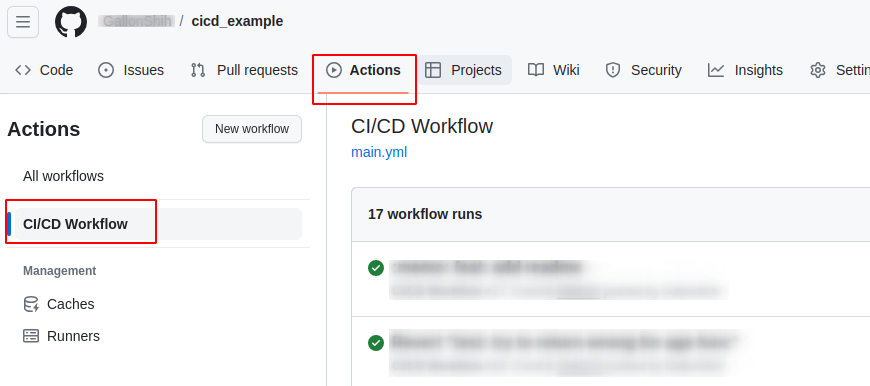
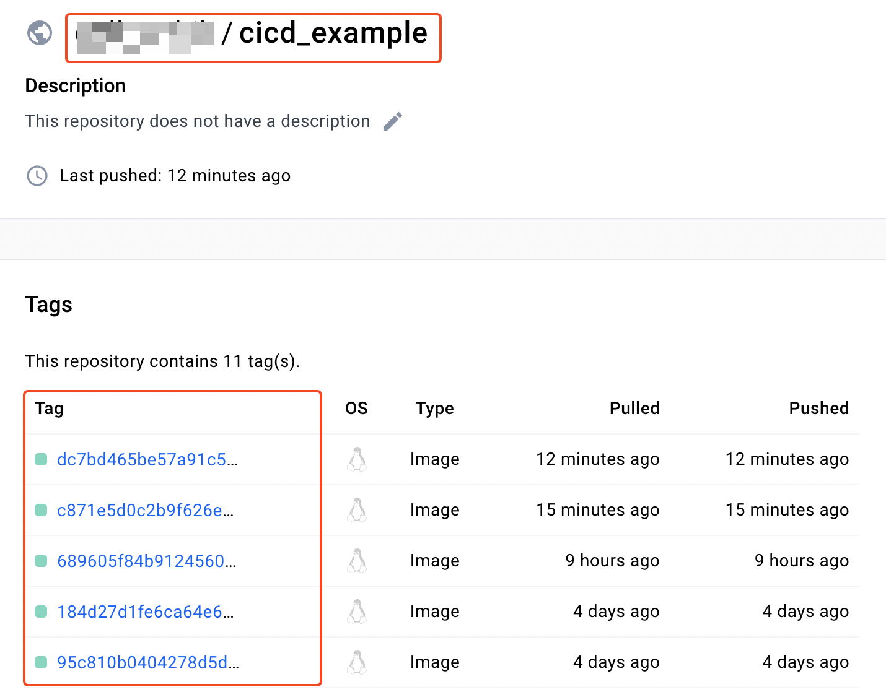
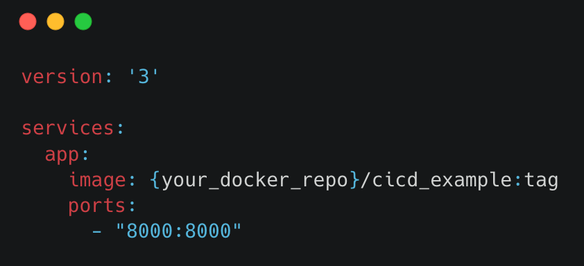

# GitHub CI/CD Example

This repository demonstrates a simple example of CI/CD (Continuous Integration/Continuous Deployment) using GitHub Actions. We have a basic FastAPI application that serves as an API server. The focus is on illustrating how to set up a CI/CD pipeline to automatically integrate your codebase and run unit tests for your functions.

## :star: Prerequisites

Before you get started, make sure you have the following:
- Git installed on your machine.
- A GitHub account.
- A Docker Hub account.
- Basic knowledge of Python programming.

## :rocket: Getting Started

1. **Fork or Copy the Repository**
    - Click the `Fork` button.

    

    - Set repository's name & click `Create fork` button.

    


2. **Set Secrets & enable Actions in GitHub**
    - Create secrets for CI/CD Actions

    

    - Add secrets: `DOCKERHUB_USERNAME` & `DOCKERHUB_PASSWORD`

    

    - Enable Actions for CI/CD

    


3. **Clone to Your Local Machine**
    - Clone the repository to your local development environment using Git.

    ```linux
    git clone https://github.com/{Owner_name}/cicd_example.git
    ```


4. **Repository Description**
    - FastAPI application in [app/main.py](./app/main.py)

    - Unit-test in [tests/](./tests/)

    - CI/CD workflow [main.yaml](./.github/workflows/main.yml)


5. **Making Changes in [app/main.py](./app/main.py)**
    - **Add a New API**: You can add new API endpoints to the FastAPI application.

    ```python
    def gender():
        return 'Man'

    @app.get("/v1/gender",
                description='Get gender',
                responses={
                            400: {"description": 'get_gender fail'},
                            500: {"description": 'Internal server error'}
                }
            )
    async def get_gender():
        gender_value = gender()
        return JSONResponse(status_code=200, content={"data": gender_value})
    ```
    - **Edit an Existing API**: Be aware that editing an existing API might cause the CI/CD pipeline to fail if the changes do not pass the unit tests.

    ```python
    def age():
        return 28 # original 18
    ```


6. **Push Changes to GitHub**
    - Commit and push your changes to GitHub. This will trigger the CI/CD pipeline defined in GitHub Actions.

    ```linux
    git add .
    git commit -m "{your commit message}"
    git push
    ```


7. **Check the CI/CD Pipeline**
    - Go to the 'Actions' tab in your GitHub repository to view the status and logs of the CI/CD pipeline.

    


8. **Launch the API Server(Optional)**
    - Docker & Docker-Compose installed on your machine.
    - Go to your [DockerHub](https://hub.docker.com/) & sign in.
    - Copy the image name with tag and paste it to [docker-compose.yaml](./docker-compose.yaml)

    

    

    - Launch api server
    ```linux
    docker-compose up -d
    ```

    - Go to [localhost:8000/docs](http://localhost:8000/docs)

    - Close api server
    ```linux
    docker-compose down
    ```
